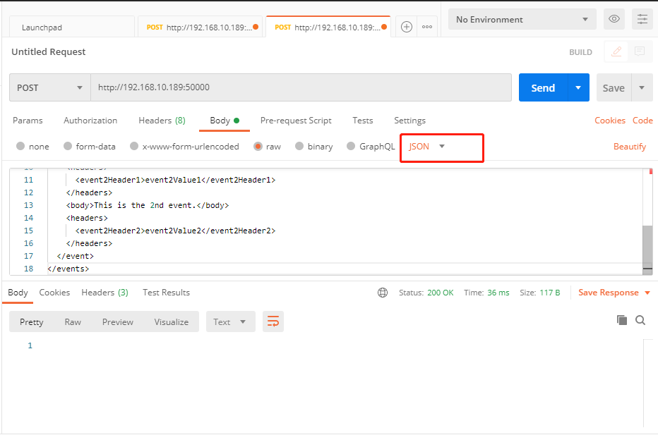

# Http Source

```
# example.conf: A single-node Flume configuration

# Name the components on this agent
a1.sources = r1
a1.sinks = k1
a1.channels = c1

# Describe/configure the source
a1.sources.r1.type = http
a1.sources.r1.bind = 0.0.0.0
a1.sources.r1.port = 44444

# Describe the sink
a1.sinks.k1.type = logger

# Use a channel which buffers events in memory
a1.channels.c1.type = memory
a1.channels.c1.capacity = 1000
a1.channels.c1.transactionCapacity = 100

# Bind the source and sink to the channel
a1.sources.r1.channels = c1
a1.sinks.k1.channel = c1
```

数据格式

```
[
    {
        "body": "123"
    }
]
```


## 自定义http source handler 实现对xml类型数据处理

<details>
<summary>pom.xml</summary>

```
    <dependencies>
        <!-- https://mvnrepository.com/artifact/org.apache.flume/flume-ng-core -->
        <dependency>
            <groupId>org.apache.flume</groupId>
            <artifactId>flume-ng-core</artifactId>
            <version>1.8.0-cdh6.1.1</version>
        </dependency>
    </dependencies>
    <repositories>
        <repository>
            <id>cloudera</id>
            <name>cloudera Repository</name>
            <url>https://repository.cloudera.com/artifactory/cloudera-repos/</url>
            <releases>
                <enabled>true</enabled>
            </releases>
            <snapshots>
                <enabled>false</enabled>
            </snapshots>
        </repository>
    </repositories>
```
</details>


<details>
打包后上传到flume lib目录下
<summary>HTTPSourceXMLHandler</summary>

```
package usingflume.ch03;

import com.google.common.base.Preconditions;
import org.apache.flume.Context;
import org.apache.flume.Event;
import org.apache.flume.event.EventBuilder;
import org.apache.flume.source.http.HTTPBadRequestException;
import org.apache.flume.source.http.HTTPSourceHandler;
import org.w3c.dom.Document;
import org.w3c.dom.Element;
import org.w3c.dom.Node;
import org.w3c.dom.NodeList;
import org.xml.sax.SAXException;

import javax.servlet.http.HttpServletRequest;
import javax.xml.parsers.DocumentBuilder;
import javax.xml.parsers.DocumentBuilderFactory;
import java.util.ArrayList;
import java.util.HashMap;
import java.util.List;
import java.util.Map;

/**
 * A handler for the HTTP Source which accepts XML formatted data.
 * Each event can contain multiple header nodes,
 * but exactly one body nodes. If there is
 * more than one body tag, the first one in the event is picked up.
 */
public class HTTPSourceXMLHandler implements HTTPSourceHandler {

  private final String ROOT = "events";
  private final String EVENT_TAG = "event";
  private final String HEADERS_TAG = "headers";
  private final String BODY_TAG = "body";

  private final String CONF_INSERT_TIMESTAMP = "insertTimestamp";
  private final String TIMESTAMP_HEADER = "timestamp";

  private final DocumentBuilderFactory documentBuilderFactory
    = DocumentBuilderFactory.newInstance();

  // Document builders are not thread-safe.
  // So make sure we have one for each thread.
  private final ThreadLocal<DocumentBuilder> docBuilder
    = new ThreadLocal<DocumentBuilder>();

  private boolean insertTimestamp;

  @Override
  public List<Event> getEvents(HttpServletRequest
    httpServletRequest) throws HTTPBadRequestException, Exception {
    if (docBuilder.get() == null) {
      docBuilder.set(documentBuilderFactory.newDocumentBuilder());
    }
    Document doc;
    final List<Event> events;
    try {
      doc = docBuilder.get().parse(
        httpServletRequest.getInputStream());
      Element root = doc.getDocumentElement();
      root.normalize();

      // Verify that the root element is "events"
      Preconditions.checkState(
        ROOT.equalsIgnoreCase(root.getTagName()));

      NodeList nodes = root.getElementsByTagName(EVENT_TAG);
      int eventCount = nodes.getLength();
      events = new ArrayList<Event>(eventCount);
      for (int i = 0; i < eventCount; i++) {
        Element event = (Element) nodes.item(i);
        // Get all headers. If there are multiple header sections,
        // combine them.
        NodeList headerNodes
          = event.getElementsByTagName(HEADERS_TAG);
        Map<String, String> eventHeaders
          = new HashMap<String, String>();
        for (int j = 0; j < headerNodes.getLength(); j++) {
          Node headerNode = headerNodes.item(j);
          NodeList headers = headerNode.getChildNodes();
          for (int k = 0; k < headers.getLength(); k++) {
            Node header = headers.item(k);

            // Read only element nodes
            if (header.getNodeType() != Node.ELEMENT_NODE) {
              continue;
            }
            // Make sure a header is inserted only once,
            // else the event is malformed
            Preconditions.checkState(
              !eventHeaders.containsKey(header.getNodeName()),
              "Header expected only once " + header.getNodeName());
            eventHeaders.put(
              header.getNodeName(), header.getTextContent());
          }
        }
        Node body = event.getElementsByTagName(BODY_TAG).item(0);
        if (insertTimestamp) {
          eventHeaders.put(TIMESTAMP_HEADER, String.valueOf(System
            .currentTimeMillis()));
        }
        events.add(EventBuilder.withBody(
          body.getTextContent().getBytes(
            httpServletRequest.getCharacterEncoding()),
          eventHeaders));
      }
    } catch (SAXException ex) {
      throw new HTTPBadRequestException(
        "Request could not be parsed into valid XML", ex);
    } catch (Exception ex) {
      throw new HTTPBadRequestException(
        "Request is not in expected format. " +
          "Please refer documentation for expected format.", ex);
    }
    return events;
  }

  @Override
  public void configure(Context context) {
    insertTimestamp = context.getBoolean(CONF_INSERT_TIMESTAMP,
      false);
  }
}

```

</details>

请求,注意格式为json

```
<events>
  <event>
    <headers>
      <header1>value1</header1>
      <header2>value2</header2>
    </headers>
    <body>This is a test. This input should show up in an event.</body>
  </event>
  <event>
    <headers>
      <event2Header1>event2Value1</event2Header1>
    </headers>
    <body>This is the 2nd event.</body>
    <headers>
      <event2Header2>event2Value2</event2Header2>
    </headers>
  </event>
</events>
```




# Spooling Directory Source

```
a1.sources=r1
a1.sinks=k1
a1.channels=c1

a1.sources.r1.type=spooldir  
a1.sources.r1.spoolDir=/tmp/cs/flume  # 监控目录，不监控该目录下子目录
#a1.sources.r1.ignorePater=*ignore
#a1.sources.r1.deletePolicy=immediate # 默认读取完成删除文件，never不删除只是重命名
a1.sources.r1.fileHeader=true  # 文件名添加到事件header
a1.sources.r1.channels=c1
a1.sources.r1.insertTimestamp=true

a1.sinks.k1.type=logger
a1.sinks.k1.channel=c1

a1.channels.c1.type=memory
a1.channels.c1.capacity=1000
a1.channels.c1.transactionCapacity=100
```