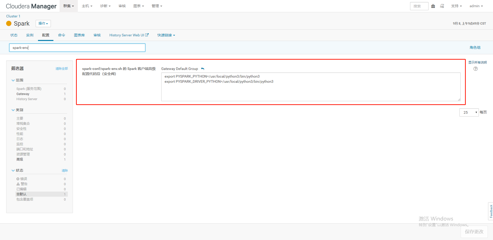

<!--
 * @Author: wjn
 * @Date: 2020-09-08 10:06:57
 * @LastEditors: wjn
 * @LastEditTime: 2020-09-08 10:16:27
-->
spark-conf/spark-env.sh  客户端

        export PYSPARK_PYTHON=/usr/local/python3/bin/python3
        export PYSPARK_DRIVER_PYTHON=/usr/local/python3/bin/python3

